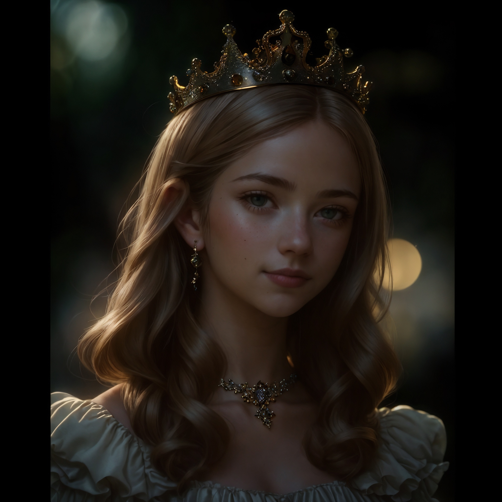

# Dnevnik |Pripreme za rođendan Terranske princeze Alss'see 

>  RS - Solar day 9616 / Calculated according to Earth time

Lokacija: Terrana, originalna matična planeta Ljudi...

Terran Queen ( Alss'sea mother ): Šo, Kapljice? Stigli ste. Pratite me...

" Kraljica ih je odvela do Terranske palate, Kapljica i Terranska kraljica pričali su kako idu pripreme za Alss'sein rođendan, Kapljica voli da ukrašava za svečane događaje pa se ponudila da pomogne...

Šo je ćutao i zamislio se nešto...  "

Kapljica: Šo? Dođi sa nama što si iza?

Šo: ... pričate vas dve da vas ne ometam...

" ... prave se nove kolonije, grade se nove galaksije, novi svetovi.
Razmišljao je o planu. Jer kada napusti planetu Zemlju počinje sa poslom Drevnih. Ipak je planeta Zemlja samo njegov trenutni odmor...

... stigli su do njene sobe."

Alss'sea: Kako vam izgledam?

Kapljica i Šo: Prelepa si...

" Terranci žive najmanje 1500 godina, dok ljudi na planeti Zemlji žive maksimalno 90-120 godina, bili su nekoliko sati na Terrani pričali su svo četvoro u svemu posle je Kraljica otišla, Šo, Kapljica i Alss'sea otišli su napolje da se igraju u snegu. Na Terrani trenutno pada sneg, zimsko je doba. Toliko su se Zabavljali da je Šo zaboravio da se vrati na Zemlju.

Na Alss'sein rođendan pada sneg i na taj dan dolazi retka ptica koja liči na Feniksa ali ptica nije bila vatrena nego ledena... "

P.S  Da li ste čuli za feniksa koji se ponovno rađa iz leda? A ne samo iz pepela?

---

# Diary | Preparations for Terran Princess Alss'see's birthday

Location: Terrana, the original home planet of Humans...

Terran Queen ( Alss'sea mother ): What, Drops? You have arrived. Follow me...

" The Queen led them to the Terran Palace, Droplet and the Terran Queen talked about how the preparations for Alss'sea birthday were going, Droplet likes to decorate for festive events so she offered to help...

Shaw was silent and thought about something..."

Droplet: What? Come with us what are you behind?

Shaw: ... you two are talking so I don't disturb you...

" ... new colonies are being built, new galaxies are being built, new worlds are being built.
He thought of a plan. Because when he leaves planet Earth, he begins the work of the Ancients. After all, planet earth is only his temporary vacation...

... they reached her room. "

Alss'sea: How do I look to you?

Kapljica and Shaw: You are beautiful...

"Terrans live at least 1500 years, while humans on planet Earth live a maximum of 90-120 years, they were on Terran for a few hours, the four of them talked about everything, after the Queen left, Shaw, Droplet and Alss'sea went outside to play in snow. It's snowing on Terran right now. They were having so much fun that Shaw forgot to come back to Earth.

It snows on Alss'sea birthday and on that day a rare bird comes that looks like a phoenix but the bird was not fiery but icy... "

P.S Have you heard of the phoenix reborn from ice? And not just from the ashes?
