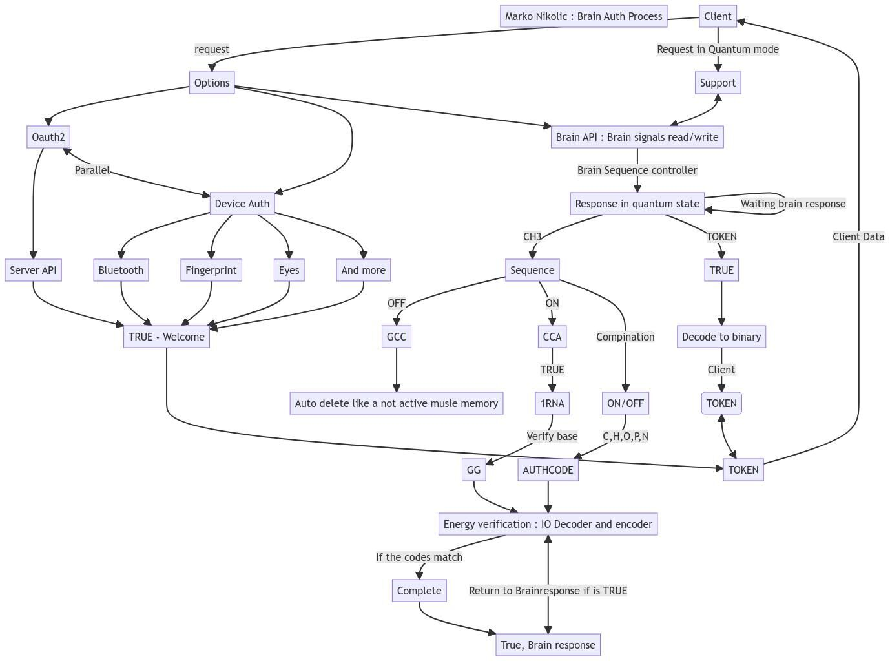

# Marko to nije moguće što pokušavaš da napraviš.

- Marko to je nije moguće što pokušavaš da napraviš.

Ovo je moj odgovor:

Međutim takve osobe ne znaju da se memorija danas može skladištiti u DNA , jedan gram bakterija može skladištiti terabajte i terabajte memorije...

Ne mislim na DNA memoriju koju dobijate evolucijom.

Nego da skladišti na primer 150TB ne u SSD/HDD nego direktno u DNA material gde memoriju konvertuje uređaj koji je između DNA materijala i na primer vašeg računara.

Ako debelo istražujete ovu temu nauke, možete sebi reći sigurno da je ovo moguće. Izuzetno je komplikovano čak i od grafičkog prikaza na prošlom objavi koja je dole.

Dole objava govori da možete mislima (tačnije šifrovanim mislima) otključati neki uređaj. Jer uređaj tada prepoznaje moždane signale kao validnu šifru ili token...

Ono što je danas itekako moguće i razvija se :

- DNA skladišćenje podataka gde se koristi u IT
- DNA inženjering u računarstvu
- Treniranje AI korišćenjem samo DNA algoritma
- Warp pogon, brzina veća od svetlosti
- Korišćenje AI za popravljanje pamćenja, tačnije amnezija...
- Da li ste znali da postoji teleportacija verovali vi ili ne? Službeno, atomskom obliku. Za dalje moguće i nečeg većeg, čoveka...

Ako je Tesla napravio razne patente sasvim sam koje koristite i dan danas.
Da li ste znali da je električni Trotinet koji je postao popularan pre neke godine. Ustvari stara tehnologija još iz početka 20 veka?

Najveći problem je kada krenete sami nešto da pravite i da debelo istražujete bez ičijie pomoći. Pokažete da radite na tome.
Odma pokušavaju da vas sputavaju, da vas zaustave.
Jer po 'pravilu' mora firma da uradi to.

Jedan primer je za moju društvenu mrežu. Koja ima sve u sebi što svaka društvena mreža ima. Ima i 30 inovacija...
Sada možete čuti iz prve ruke:

Opisao šta sam napravio , pokazao snimak da radi i da je stvar realna i da nije šala. Još dao link da provere.

Naravno nisam dobio odgovor.

- Zašto ne radiš sa nekim? Zašto radiš i proučavaš sam?

Probao sam već jednom. Ljudima ne možete verovati ako istražujete nove tehnologije. Za stare sa svakim možete raditi.
Za nove tehnologije je već druga priča.

Priznajem nije moguće jer nisam u laboratoriji ali Virtuelizacija je izašla iz raja pa možete da radite virtuelno svašta što vam padne na pamet.

Morate priznati šta je ono najgore. Skoro 90% tehnologije koje vidite danas nije nova tehnologija nego prerađena tehnologija. 10% se pazi da ne dođe u javnost od pojedinca nego od neke tamo kompanije.

Da li 10% sputava neko to je već druga tema, ali reću vam ovo za tu temu,
zašto bi vi plaćali struju kada hipotetički rečeno postoji uređaj koji radi pomoću pod svemira i daje vam beskonačnu energiju veličine pola cm?

P.S Društvena mreža koju sam napravio sa svim i svačim, nije ništa naspram onog što se radi u tajnosti i za koje planiram kada završim da objavim svima javno i biću otvoren za argumentovane kritike i tople pohvale.

