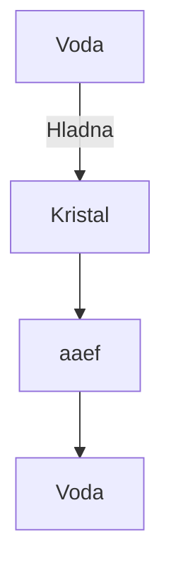

# ⚛Memorijski kristali - Tehnologija budućnosti...

- Marko Nikolić , [instagram.com/nikoliccc02](https://instagram.com/nikoliccc02), [linkedin.com/in/markonikolic98](https://linkedin.com/in/markonikolic98) -

> Memorijski kristali nisu oni obični koji su nastali prirodnim putem, nego oni koji su veštački napravljeni i obrađivani pod temperaturom od 5000 °C do 15.000 °C pod antigravitacionim pritiskom od 150.000 bara (13985 tona)... Takve legure su jake kao Dijamanant a provode električnu energiju bolje kao zlato možda čak i bolje...
>
> Sama tehnologija za proizvodnju ovakvih kristala mora biti naprednija čak i od današnje s-kojom se prave naniti (Naniti su roboti, veličine ćelije.).
>
> Memorijski kristali su u obliku pločice sa nano optičkim zadebljanjima u sebi koja mogu da služe kao CPU,GPU ,RAM  za skladišćenje ogromne količine memorije ili napajanje skaldišćenje električne energije ...

- Zašto od 5000 °C do 15.000 °C i kakvu ulogu igra Antigravitacioni pritisak?
- Zašto je potreban pritisak od 150.000 bara ili 13985 tona?
- Zašto je ta tehnologija primenljivija tačnije zašto je bolja od ove današnje čak i od kvatnih računara?
- Da li je tehnologija Memorijskih kristala uopšte moguća?
- Gde se koristi?
- Zašto je opasna i zašto je dobra?

# Zašto od 5000 °C do 15.000 °C i kakvu ulogu igra Antigravitacioni pritisak?

- Uloga Antigravitacionnog pritiska? Je u tome što tokom topljenja ujedno i obrade, raspoređuje se kristalna rešetka i atomi tamo gde trebaju. Slično kao da se radi Lasersko štampanje CPU-a pomoću template-a. Dok je Antigravitacioni pritisak mnogo efektivniji u 3D!

# Zašto je potreban pritisak od 150.000 bara ili 13985 tona?

Prilikom proizvodnje memorijskih kristala vrši se i statičko programiranje čipova, unosom gotovog programa. Pritisak služi da se program zamrzne tačnije da ne može da se izmeni. Dok posle proizvodnje Kristal može normalno primati nove programe i brisati stare... 

---

> Statični program služi za samu kontrolu rada kristala. Svaki pokušaj izmene njegovog koda dovešće do ne ispravnosti kristala. Tačnije sigurnosni protokol.

Statični program u sebi zadrži:

- Kontrolu kristala
- Min & Max temperatura
- Protok informacija i skladišćenje
- Kontrola provodljivosti energije
- Automatsko ispravljanje vizičkih oštećenja (nano tehnologija, kristal može trajati po samoj hemijskoj strukturi hiljadama godina, dok su naniti programirani kroz statični program da traju svega 100 godina! Naniti se reaktiviraju novim, tako što program sam menja kod... Sigurnosni mehanizam je taj ukoliko nanit pokuša da onesposobi zaštitni kod, kristal se utomatski formatira, pre formatiranja korisnik će znati unapred. A sva memorija će biti enkriptovana i prebačena utomatski u drugi ispravni kristal. )

# Zašto je ta tehnologija primenljivija tačnije zašto je bolja od ove današnje čak i od kvatnih računara?

Sama tehnologija Memorijskih kristala je takva, kao kod prethodnog odgovora ima u sebi Nanite koji ispravljalju fizička oštećenja, sama provodljivost energije i memorije je odlična, dok se za prenos podataka žičnim putem koriste optička vlakna, **koja prenose samo informacije putem svetlosnih implusa**. Koji su ograničeni samo na nit unutar optičkog kabla, tj unutar izolacije ako ima izolaciju od spoljnih fizičkih uticaja... 

Dok kristali koriste svetlosne impluse kroz ceo kristal, i provodljivi su. Dok Sam Statični program kontroliše provodljivost i svetlosne impluse da se ne mešaju. 

Sama legura kristala je takva da energija ne može da naudi Čoveku ili bilo čemu organskom jer energija ne odlazi van kristala, tačnije spolja nije provodljiv samo ukoliko se stavi u port nekog uređaja ili ako se kristali spoje.

>  Tehnologija duplih kristala je jednostavno takva na primer: Ukoliko imate jedan od 2TB i spojite sa onim od 5TB imaćete 7TB. Ne morate stavljati dva zasebno u dva različita porta, dovoljno je da spojite kristale. Na njemu su posebna mesta za spajanje... 

Što je najbolje, kristali zbog same svoje legure se pasivno hlade, efektivnost hlađenja pasivno je od -10 °C do 50 °C.
Hlađene kristala tokom obrade podataka i smanjivanje temperature:

- Pasivno
- Vodeno (Koristi se neki flud, ne obična voda, međutim obična voda zbog same tehnologije ne može da poremeti rad kristala, sama tehnologija Memorijskih kristala se može koristi i za prečišćavanje vode.)

Diagram kako hlađenje funkcioniše sa vodom, tj prečiščavanje...

P.S Naravno postoji i druga metoda da se oni naprave i sama Legura istih nek ostanu tajna...
