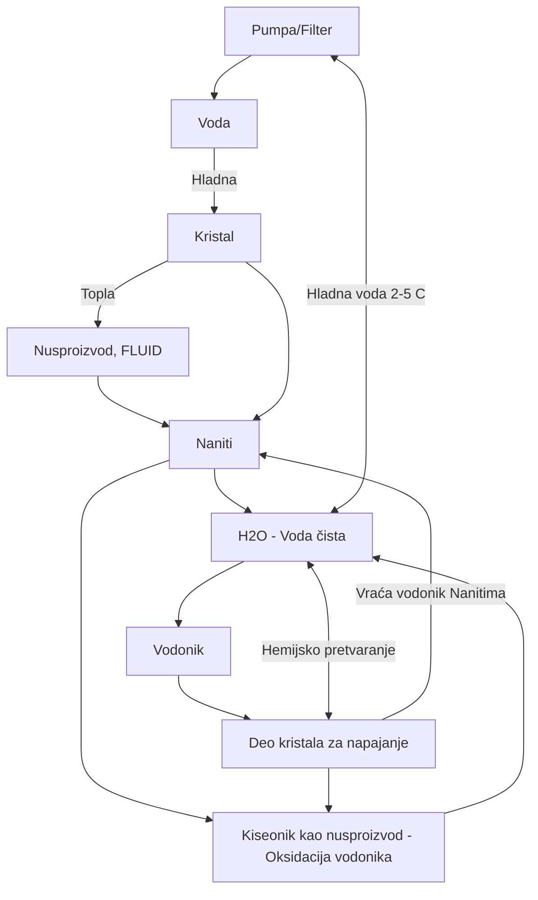

```mermaid

graph TD


P[Pumpa/Filter]-->H

H[Voda]-->|Hladna|A

A[Kristal]-->|Topla|VODA[Nusproizvod, FLUID]


VODA-->M


A-->M[Naniti]-->H20[H2O - Voda čista]-->HF[Vodonik]


HF-->KRW

KRW[Deo kristala za napajanje]<-->|Hemijsko pretvaranje|H20


H20<-->|Hladna voda 2-5 C|P


KRW-->|Vraća vodonik Nanitima|M

M-->Oxugyn[Kiseonik kao nusproizvod - Oksidacija vodonika]


 Oxugyn-->H20


KRW-->Oxugyn


```
